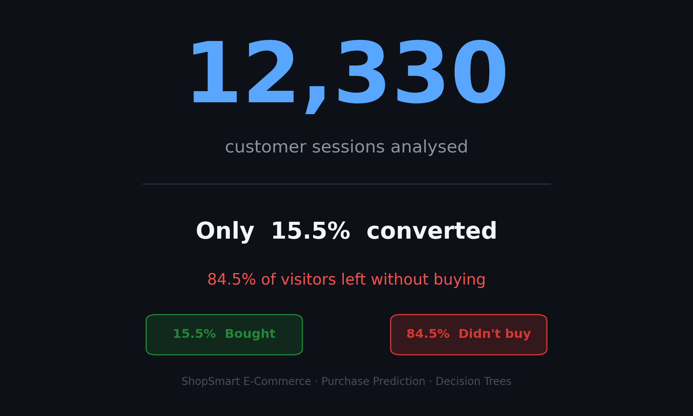
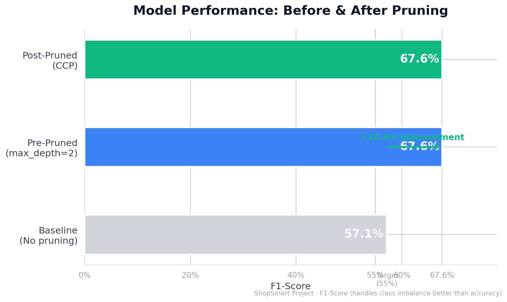
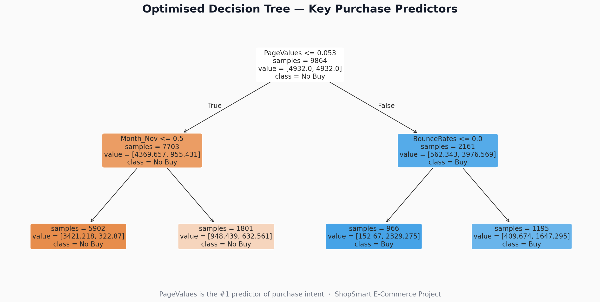
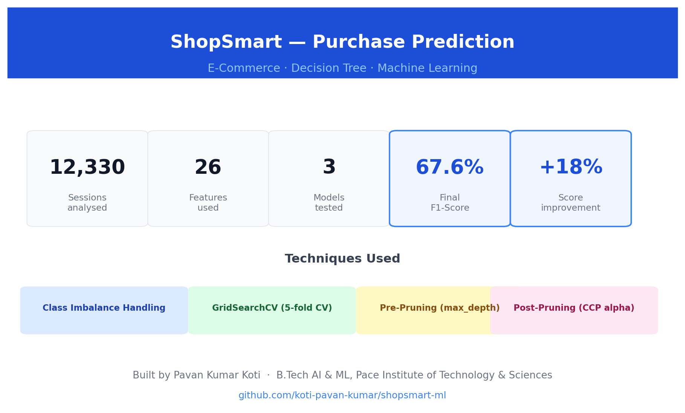

# ShopSmart Purchase Prediction ML Project

An end-to-end Machine Learning project designed to predict consumer purchase behavior using classification algorithms.

## 📊 Key Insights & Results
Below are the visual summaries of the project execution and data analysis:

### 1. Project Performance Hook

### 2. Model Performance Results

### 3. Decision Tree Architecture

### 4. Project Executive Summary

---

## 💻 How to View the Full Code
GitHub's built-in notebook viewer is currently experiencing a rendering timeout due to layout structures. You can access and read through the complete source code, markdown explanations, and functions using the live external mirror below:

👉 **[View Complete Jupyter Notebook via Google Colab](PASTE_YOUR_COLAB_SHARE_LINK_HERE)**
